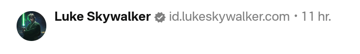

# Nostr Identification on Netlify

Self-host your Nostr profile [NIP-05] identification on [Netlify]. For free!

## Use-case

- You own a personal domain (e.g. `lukeskywalker.com`)
- You host a website on it, but you can't or don't want to add the `nostr.json` file to it 
  (e.g. the website is hosted on a blogging platform)
- You want to identify your Nostr profile as the owner of the domain: `id.lukeskywalker.com`
  
## Instructions

### Prepare the code

**1. Clone this repository.**

Name it as you wish. I've named mine `id.voskoboinyk.com` to make it super clear what it's for. 

**2. Set your Nostr pub key**

Edit `public/.well-known/nostr.json`, and replace the long zero-ed string
with your public key **in hex format**. 

You can convert your `npub...` key to the hex format on https://nostrcheck.me/converter/.

**3. Setup the redirect**

Edit `public/_redirects`, and replace the Github repo URL with your website URL.  This is where the visitors will land when pasting your identifier into their browser address line.  
   
**4. Push changes to Github**

Make sure you've committed and pushed your changes to Github.

### Deploy

1. Get a [Netlify] account, create a new project, 
and set it up to using your new Github repository.

2. Add a custom domain to the Netlify project: `id.yourdomain.com` 
(you can use any subdomain instead of `id`, actually; up to you).

3. Configure the required DNS record using your domain management dashboard. 

### Update your Nostr profile

Go to your Nostr client and update your profile with the new idenfier: `_@id.yourdomain.com`.

The underscore is a trick to not have local part (i.e. username) in your NIP-05 identifier. 
Read about it in the [NIP-05] spec.

### ✅ Done

Congrats! Though it wasn't that difficult, take a moment to celebrate it. You deserve it! Here, take a donut 🍩. 

😉

## FAQ

**Host on Netlify is not really *self*-hosting** 

Yes, you're right. :) 

Still, you're pretty much in full control of your verification, unlike having a _nostrcheck.me_ or a _nostr.com_ identifier.  

[NIP-05]: https://github.com/nostr-protocol/nips/blob/master/05.md
[Netlify]: https://www.netlify.com/

**I want my identifier to use the main domain name**

This is the limitation of hosting the identification outside of your main website.

If you don't like having the `id.` prefix in your identifier, the only was is to
make the `.well-known/nostr.json` file accessible on your main domain. 
If you can do that, that's even better.

Also, don't forget about CORS headers too.
See https://nostr.how/en/guides/get-verified for detailed instructions. 

## Credits

Implemented by 👾 [Ivan Voskoboinyk](https://voskoboinyk.com/).
